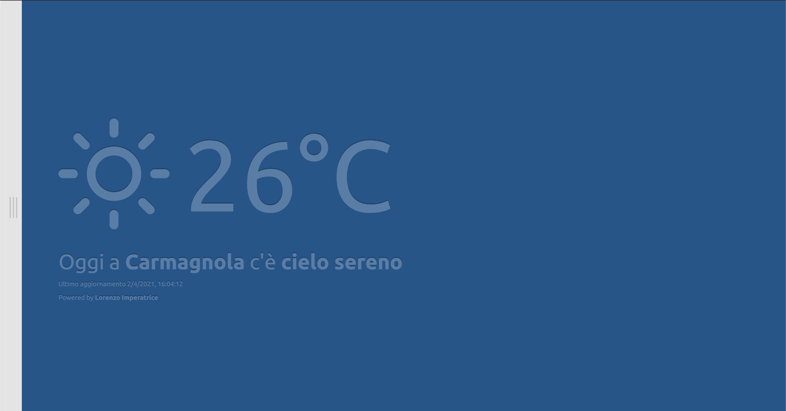
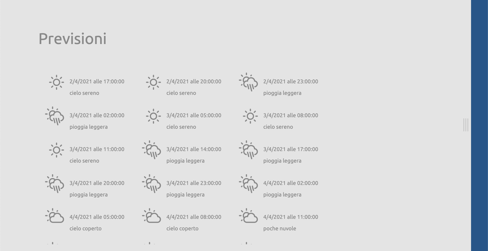

# Meteo

Quest'applicazione è stata realizzata per un processo di selezione presso una compagnia di Torino.

L'applicazione ha il compito di mostrare il meteo e le previsioni della località in cui si è geolocalizzati.

L'applicazione utilizza le API di Open Weather Map ed utilizza il framework front-end ReactJS.





## Installazione

### Open Weather setup

Come prima cosa è necessario disporre di un API key di Open Weather, è totalmente gratuita creandosi un account a questo [link](https://home.openweathermap.org/users/sign_in).

Dopo aver clonato il progetto bisogna creare il file `.env.local` nel quale si va a copiare l'API key di Open Weather utilizzando come variabile di ambiente `REACT_APP_OPEN_WEATHER_API_KEY`.

il risultato finale dovrebbe essere:
```
REACT_APP_OPEN_WEATHER_API_KEY=<API_KEY>
```

### Installazione delle dipendenze

Questo progetto utilizza Yarn come gestore di dipendenze. Per installarle basterà lanciare il comando:

```
$ yarn
```
All'interno della cartella del progetto